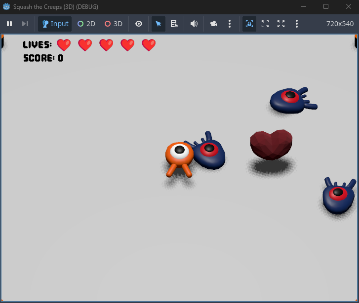
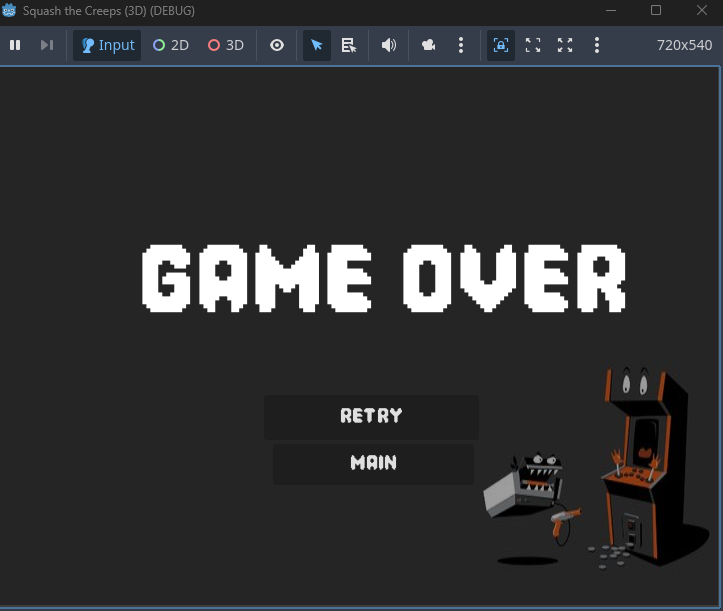
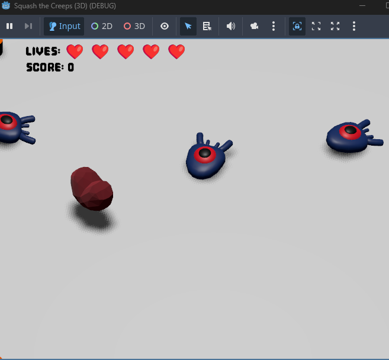

# 3D Squash the Creeps

¡Bienvenido a **3D Squash the Creeps**! En este emocionante juego, tu objetivo es aplastar a tantos mobs como sea posible mientras sobrevives el mayor tiempo posible. Con un límite de 7 vidas, deberás ser ágil y estratégico para alcanzar la puntuación más alta.

---

## 🕹️ Cómo Jugar
1. **Objetivo**: Aplasta a los mobs que aparecen en la pantalla para ganar puntos.
2. **Vidas**: Comienzas con 5 corazones. Puedes recuperar corazones con el boost de recuperación, pero no puedes exceder el límite de 7 vidas.
3. **Puntaje**: Tu puntaje se muestra en la pantalla durante el juego.
4. **Game Over**: Si pierdes todas tus vidas, aparecerá la pantalla de "Game Over".

---

## 🎮 Características Principales
- **Máximo de 7 vidas**: Representadas en la pantalla de `vidas`.
- **Puntaje visible**: Observa tu progreso en la pantalla de `score`.
- **Pantalla de inicio**: Comienza tu aventura desde la pantalla de `HOME-SCREEN`.
- **Pantalla de Game Over**: Descubre tu destino en la pantalla de `game-over-screen`.
- **Boost de recuperación**: Recupera un corazón con el boost de `heart-recovery-boost`, pero solo si tienes menos de 5 corazones.
- **Sonido de fondo**: Disfruta de una banda sonora única mientras juegas.

---

## 📸 Pantallas del Juego
### Pantalla de Inicio

### Pantalla de Juego

### Pantalla de Game Over

### Boost de Recuperación

### Vidas

### Puntaje

---

## 👨‍💻 Créditos
- **Desarrollador**: Andres Iles
- **Motor de Juego**: Godot Engine
- **Recursos**: Imágenes y sonidos utilizados en el juego.

---

¡Gracias por jugar **3D Squash the Creeps**! ¿Cuántos mobs puedes aplastar?